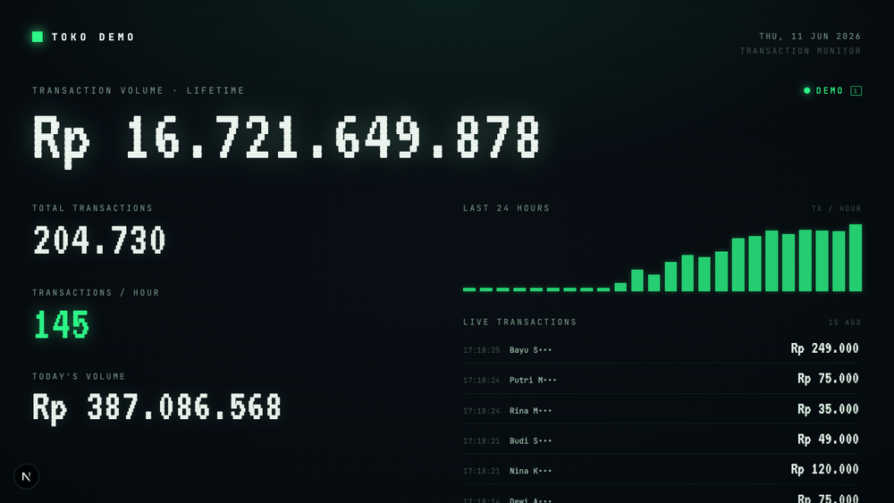

# Mayar MTS (Monitor The Situation)

A CRT-style big-screen dashboard for monitoring [Mayar](https://mayar.id) transactions in real time. Phosphor-green-on-black, scanlines, vignette, glowing pixel numerals — built to be thrown on a wall display.



## Features

- **Lifetime TPV** — giant hero number in Indonesian Rupiah format (`Rp 16.721.122.619`)
- **Total transactions**, **transactions/hour**, **today's volume**
- **Last 24 hours** bar chart + **live transaction ticker** (customer names masked)
- `LIVE / DEMO / SYNC / OFFLINE` status badge, WIB clock
- **First-run setup** — paste your Mayar API key; it's stored only in the browser's localStorage
- **Demo mode** — explore with simulated data, no key needed
- **Tweaks panel** — accent color (Phosphor Green / Amber / Cyan / Mayar Blue), refresh interval, scanlines, compact numbers, ticker on/off

## How it works

- Next.js (App Router). The page is a single client component.
- `/api/transactions` is a serverless proxy that forwards to `GET https://api.mayar.id/hl/v1/transactions` ([docs](https://docs.mayar.id/api-reference/transaction/paidtransaction.md)) with your key as a Bearer token. This avoids browser CORS restrictions; the key is sent per-request via header and never stored server-side.
- First load does a full paginated sync (up to 150 pages × 100) to compute lifetime totals, then refreshes incrementally every 60s (configurable). Aggregates are cached in localStorage so the screen survives reloads without re-syncing.

## Development

```bash
npm install
npm run dev
```

## Deploy to Vercel

```bash
npx vercel
```

Or import the repo at [vercel.com/new](https://vercel.com/new) — zero config, the API route deploys as a serverless function automatically.

## Getting an API key

Create one at [web.mayar.id/api-keys](https://web.mayar.id/api-keys).
